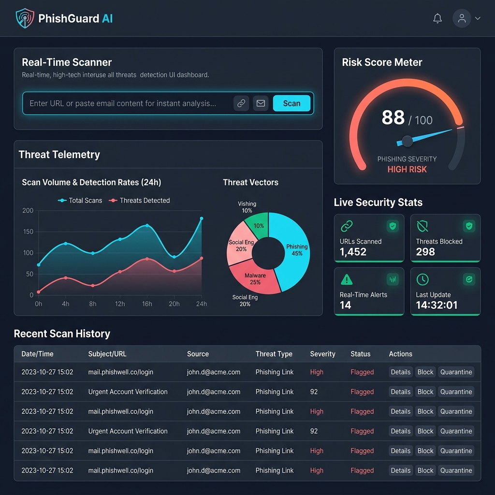
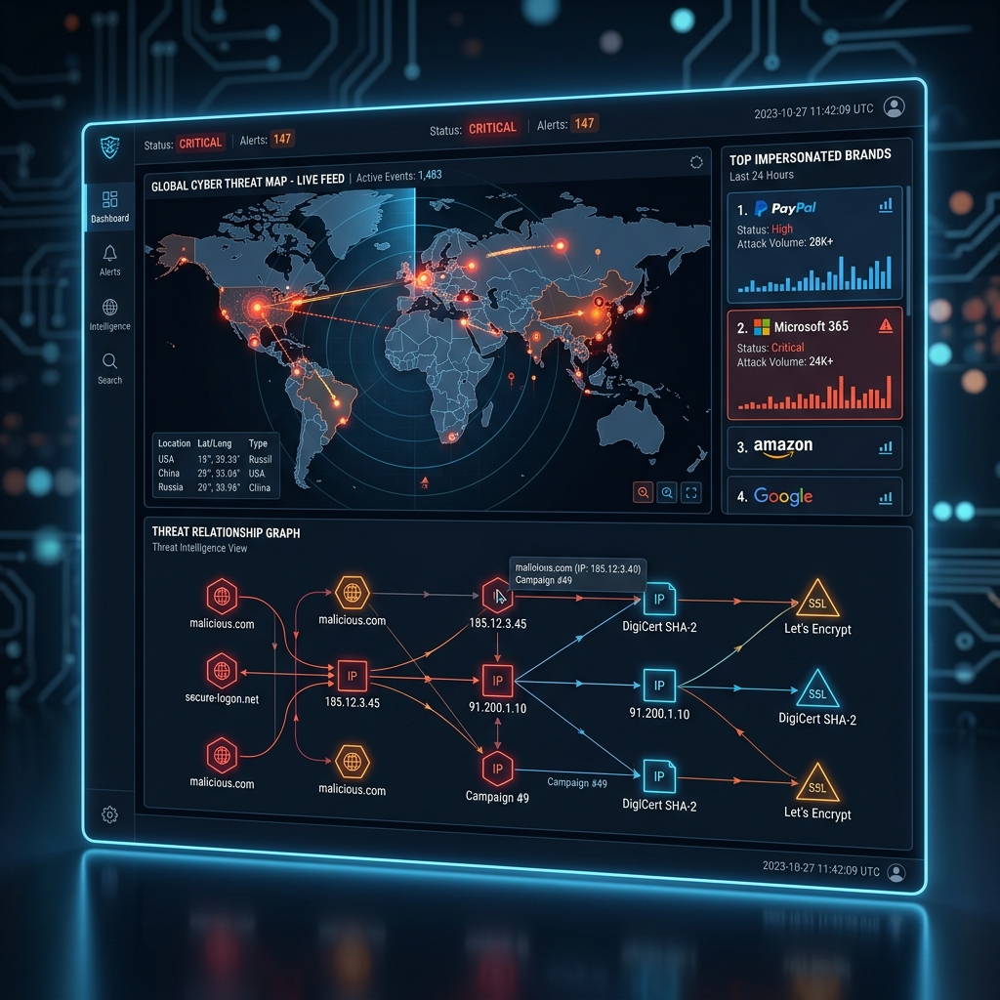
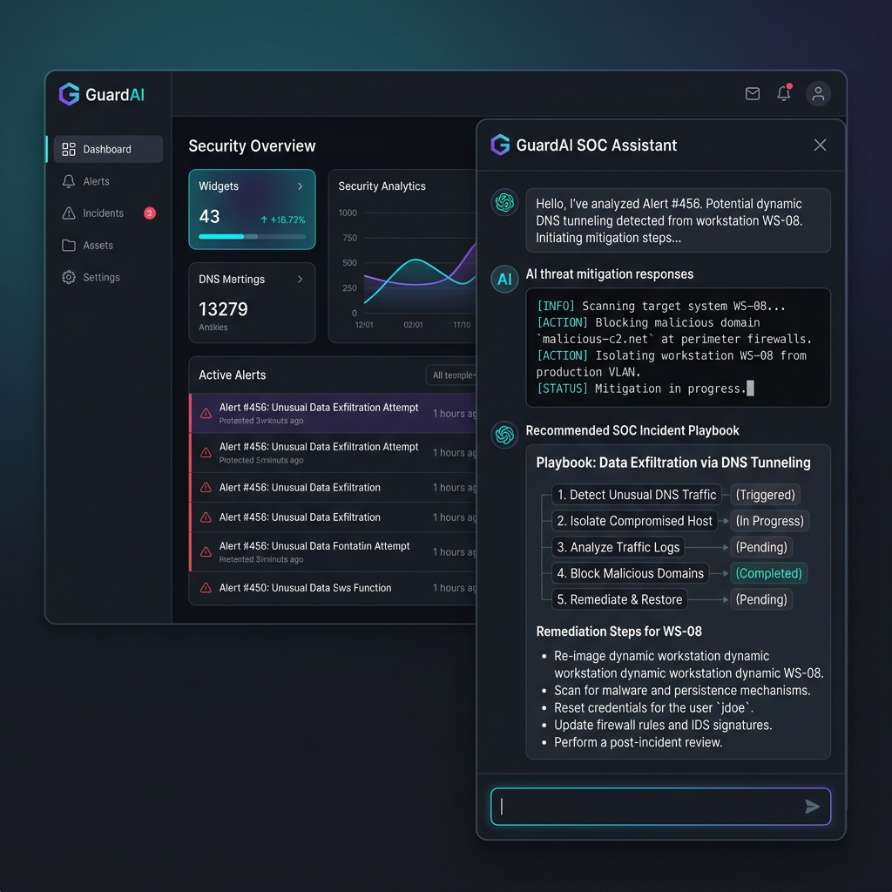

# 🛡️ PhishGuard AI — Enterprise Phishing Detection & Threat Intelligence Platform

[](https://github.com)
[](https://python.org)
[](https://fastapi.tiangolo.com)
[](https://react.dev)
[](https://typescriptlang.org)
[](LICENSE)

**PhishGuard AI** is a state-of-the-art, enterprise-grade AI phishing detection and threat analysis platform. It combines real-time multi-parameter URL feature extraction, Scikit-Learn Random Forest machine learning models, RFC 822 email header inspection, live WebSockets telemetry, SIEM threat exporters (CEF, STIX 2.1, Syslog), SOAR automated playbooks, and an interactive GuardAI SOC Assistant.

---

## 📸 Interface & Key Functionality Showcase

### 1. SOC Threat Dashboard & Real-Time URL Scanner
The main SOC Dashboard provides security teams with immediate visibility into active threat levels, real-time risk scores (0–100), transparent lexical breakdowns, and live threat telemetry streams.



* **Multi-Parameter Feature Extraction**: Evaluates homoglyph substitution, typosquatting variants, domain entropy, SSL validity, subdomain count, and raw IP host detection.
* **Transparent Risk Engine**: Explains exact risk factors causing high risk scores with severity tags (`SAFE`, `GUARDED`, `SUSPICIOUS`, `PHISHING`).

---

### 2. Global Cyber Threat Map & Relationship Graph
Interactive radar monitoring active threat origins around the globe, tracking brand impersonation heatmaps, and visualizing connected infrastructure node networks.



* **Geo-Targeting Intelligence**: Tracks threat origin clusters across North America, Europe, Asia-Pacific, and South America.
* **Threat Relationship Network**: Maps connected Domain, IP, SSL Certificate Fingerprint, ASN, and Campaign nodes for SOC threat hunters.

---

### 3. GuardAI SOC Security Analyst Chat Assistant
Platform-wide AI assistant drawer providing instant threat analysis, RFC email header validation, SSRF protocol policies, and recommended SOC incident mitigation playbooks.



* **Contextual Incident Response**: Generates step-by-step SOC playbooks for firewall domain sinkholing, DNS blacklisting, and endpoint quarantine.
* **Email Security Inspector**: Parses `.eml` files and raw email headers to detect SPF/DKIM/DMARC failures and Reply-To spoofing.

---

## 🔥 Key Platform Features

* **⚡ Real-Time URL & Batch Scanner**: Scan single URLs or process up to 50 URLs concurrently with aggregate risk metrics (`POST /api/v1/scans/batch`).
* **📧 RFC 822 Email Inspector**: Comprehensive analysis of raw email headers, body links, and authentication alignment.
* **🤖 Random Forest ML Pipeline**: Machine learning probability scoring with online retraining and model version registry (`POST /api/v1/admin/models/retrain`).
* **🛡️ SSRF Security Guard**: Enforces RFC 1918 private IP subnets (`10.0.0.0/8`, `172.16.0.0/12`, `192.168.0.0/16`) and cloud metadata endpoint blocks (`169.254.169.254`).
* **📡 Live Threat Intelligence Feeds**: Serve structured JSON IOC feeds or plaintext domain blocklists for firewall/DNS sinkhole ingest (`GET /api/v1/threats/feed`).
* **📄 SIEM & Executive Report Exporters**: Export findings in CEF, STIX 2.1 JSON, Syslog, or generate a professional HTML Executive Security Brief.
* **⚙️ SOAR Incident Response**: Execute automated mitigation actions (`firewall_sinkhole`, `dns_blocklist`, `endpoint_quarantine`, `notify_users`).
* **🔒 OWASP Security Auditor & Latency Benchmarking**: Built-in security posture checker and millisecond scan performance benchmarks.

---

## 🛠️ Technology Stack & Languages

| Component | Technologies & Languages Used |
| :--- | :--- |
| **Backend API** | Python 3.14, FastAPI, Uvicorn, SQLAlchemy, Pydantic, PyJWT |
| **Machine Learning** | Scikit-Learn (Random Forest), NumPy, Joblib |
| **Frontend UI** | TypeScript, React 18, Vite, Tailwind CSS, Lucide React Icons |
| **Database** | SQLite (Development) / PostgreSQL (Production) |
| **DevOps & Infrastructure** | Docker, Docker Compose, Nginx, GitHub Actions CI/CD |

---

## 🚀 Quickstart Local Installation

### Prerequisites
- **Python 3.10+** installed
- **Node.js 18+** & `npm` installed

### 1. Clone & Set Up Backend
```bash
# Navigate to backend directory
cd backend

# Create virtual environment (optional)
python -m venv venv
source venv/bin/activate  # On Windows: venv\Scripts\activate

# Install dependencies
pip install -r requirements.txt

# Start backend server
python -m uvicorn app.main:app --host 127.0.0.1 --port 8000
```
Backend will be available at: **`http://127.0.0.1:8000`** (Interactive Docs: **`http://127.0.0.1:8000/docs`**)

### 2. Set Up Frontend
```bash
# Open a new terminal and navigate to frontend directory
cd frontend

# Install dependencies
npm install

# Start frontend dev server
npm run dev
```
Frontend will be live at: **`http://127.0.0.1:5173`**

---

## 🧪 Running Master System Verification Tests

Execute the master automated test runner to run all test suites (Phases 1 through 11):

```bash
python backend/tests/run_tests.py
```

Expected Output:
```text
================================================================
PHISHGUARD AI - MASTER AUTOMATED SYSTEM VERIFICATION SUITE
================================================================
...
[SUCCESS] ALL PHASES (PHASE 1 - 11) AUTOMATED SYSTEM VERIFICATION PASSED!
================================================================
```

---

## 🌐 Production Deployment (Docker Compose)

PhishGuard AI includes a multi-container Docker setup ready for production hosting:

```bash
# Build and start all services in detached mode
docker-compose up -d --build
```

---

## 📄 License

Distributed under the MIT License. See `LICENSE` for more information.
